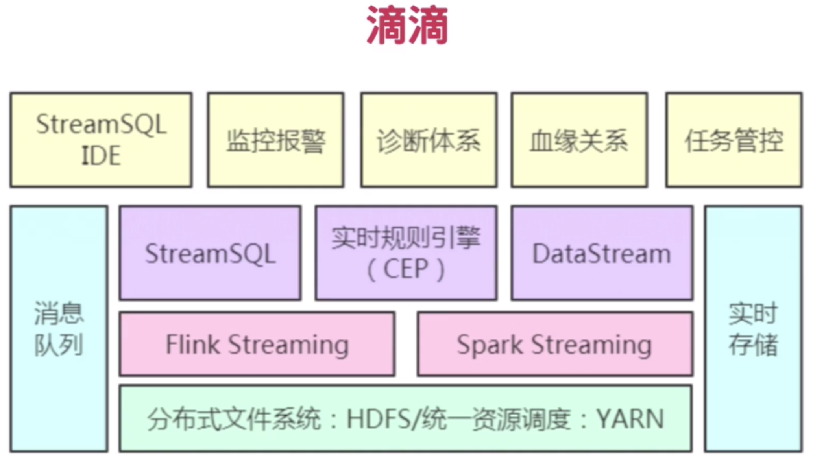

其他项目

数据离线分析（Nginx、Hadoop、Flume、Kafka、Hive）、ELK大数据搜索项目还有就是Spark实时计算

# 初识

## 简介

hadoop处理和计算数据

hadoop自身MapReduce效率不高，需要引入分布式计算引擎

hadoop集群服务业务，业务抽象成任务，任务被（调度系统）统一调度，（查询引擎）结果使用和分析

## 版本

*Azkaban*是个简单的批处理调度器，用来构建和运行Hadoop作业或其他脱机过程。

## 演示

集群存储：HDFS存储

集群计算：实时了解集群状态:活跃节点死亡节点，各个队列活跃的状态

运营：业务线，开发还是运维后续都与业务线有关

任务：将业务拆分成可复用插件。比如对某类数据需要解析计算

任务：任务流程，编排插件

编辑流程

数据查询：

可视化：

日志：查询每个人的操作历史

## 预备知识

Linux命令

Hadoop生态了解

java基础，SpringBoot

## 大数据平台应该做什么

数据接入：

类型多样

存储：

种类多样

数据仓库主要联机分机处理，提供海量数据查询分析

HBase非结构化读写，快速计算能力

计算：

离线批处理

实时流处理

机器学习预测

安全：

数据隔离、用户权限

数据管理:

统一数据保证质量

数据查询&可视化：

集群监管和管理：

硬指标：

稳定、可扩展、安全、（工具化、平台化、产品化）

## 为啥做大数据平台

解决：

打拼数据孤岛

内外分析

数据量综合分析

达到：

决策目的

## 技术栈

Hadoop基础框架HDFS、Yarn存储和调度

数仓Hive通用业务数据库

高效计算引擎：计算引擎Spark、查询引擎Presto

核心：Azkaban的调度系统，支持批处理的作业+自研资产管理服务，数据治理数据管理+sql查询分析可视化

其他组件：Ranger的权限认证、平台监控OpenTSDB&Granafa、集成开发环境基于Zepplin

离线批处理，流式计算，sql查询都很好支持 

## 公司技术栈参考

提供很多大数据开源组件

elk

知乎

滴滴偏向实时

# 数据仓库

## 定义

多数据源

elk处理（e抽取、l转换、load加载）

数据主题

集成起来提供决策和联机分析的数据环境

## 对比数据库

数据库是面向事务的设计，数据仓库是面向主题设计的
数据库一般存储在线交易数据，数据仓库存储的一般是历史数据
数据库设计是避免冗余，采用三范式的规则来设计，数据仓库在设计是有意引入冗余，采用反范式的方式来设计

## OLTP VS OLAP

OLTP实时业务 OLAP数仓联机分析，实时性差

联机事务处理OLTP是传统的关系型数据库的主要应用，主要是基本的、日常的事务处理，例如银行交易
联机分析处理OL AP是数据仓库系统的主要应用，支持复杂的分析操作，侧重决策支持，并且提供直观易懂的查询结果

## 为什么构建数仓

数据格式不统一、关系混乱 

业务只适用OLTP，不适用OLAP分析

对多业务数据统一分析

## 如何实现
实现通用型数据ETL工具
根据业务建立合理的数据分层模型(如知乎)

## 数据仓库分层WHY HOW

避免数据沼泽，数据后期使用重复计算

STG

原始数据

全部保存

表命名规范：stg-主题-表内容-分表规则

ODS

数据初步处理，如去除脏数据

默认保存30天

表命名规范：ods-主题-表内容-分表规则

DWD

数据宽表，满足业务80%的需求（一般不提供给业务直接用）

保留历史所有数据

表命名规范：dwd-业务描述-时间粒度

DWS

汇总业务数据提供计算（业务使用，粗细粒度）

保留历史所有数据

表命名规范：dws-业务描述-时间粒度-sum

DIM

公共数据，用于DWD和DW数据关联

按需存储，一般保留历史所有数据

表命名规范：dim-维度描述

DM

用于BI、多维分析、标签、数据挖掘（只考虑某个业务，而非整体架构）

按需存储，一般保留历史所有数据

表命名规范：dm-主题-表内容-分表规则

解决时间换空间存在问题

减少不必要的数据层级

## Hive简介

**hive vs hadoop**

执行语句，hive基于Hadoop的数仓工具，提供类SQL的语法

（sql转为mr任务，通过mr任务访问HDFS数据，通过hadoop的两大核心实现数据分析的能力）

数据存储，以MR作为计算引擎，HDFS作存储系统 。

元数据：hive存储的是结构化数据，将HDFS存储的数据映射成数据库、表（库和表的**元数据**，一般存储在外部关系性数据库，常用mysql，与Presto Impala共享）

**hive vs 数据库**

